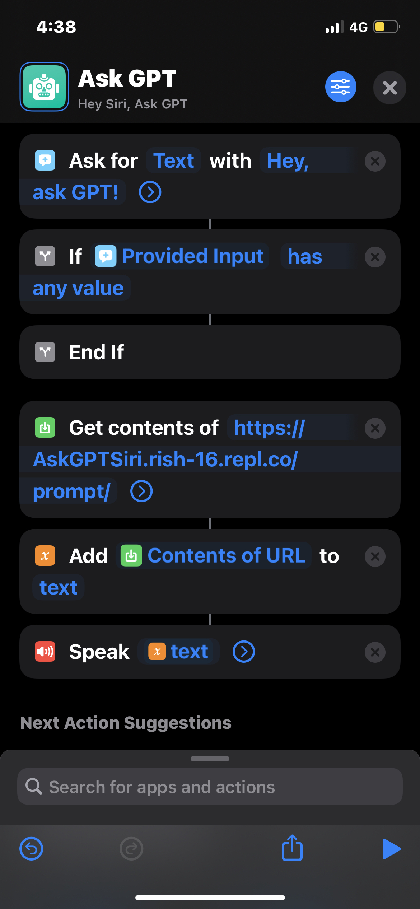

# heimdall
`Heimdall`: access the power of GPT-3 straight from Siri on any apple product.

## What is it?
`heimdall` is a Siri Shortcut that lets you access the GPT-3 API from OpenAI directly through Siri. You can ask Siri to "Ask GPT" and it'll send your query as a prompt to an intermediate server that forwards the prompt to the GPT-3 API.

## How does it work?
A `flask` server (found at `src/restful/app.py`) is hosted as a RESTful API on [Replit](http://replit.com). When the custom Siri Shortcut is activated from an iOS device, it takes the user query and sends a `POST` request to the flask server. The server forwards the query as a prompt to GPT-3, accessed through the `openai` library. The generated response is then sent back through the server and is read aloud by Siri on the device.

## Siri Shortcuts
_Siri Shortcuts_ is an iOS app (available on iPhone and iPad) that allows users to create custom actions for Siri (eg: saying "Hey Siri, I'm almost home" might switch on your smart lights and open the garage door). `heimdall` is also a custom Siri Shortcut that looks like so:

    

In order to configure this on your device, ensure you have the **Shortcuts** installed. Open it and tap the **+** icon on the top-right corner. Here's the recipe of blocks to add – everything in in-line `blocks` is an input you need to type in yourself.

1. Ask for `Text` with `Hey, ask GPT!`
2. If `Provided Input` `has any value`
3. Get contents of `https://AskGPTSiri.rish-16.repl.co/prompt/`
4. Add `Contents of URL` to `text`
5. Speak `text`

The URL in step `3` has to be updated should you deploy your own Replit server with the same code but a different project name.

Click the `play` button at the bottom-right corner to test the Shortcut. Click the `share` icon next to it and click **Add to Home Screen**. This makes the app show up on your home screen, allowing Siri to access it when invoked.